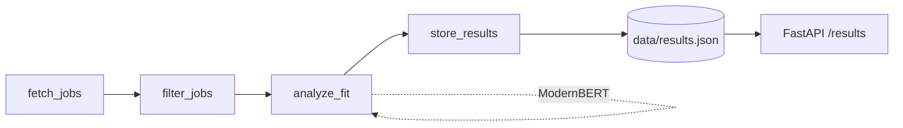
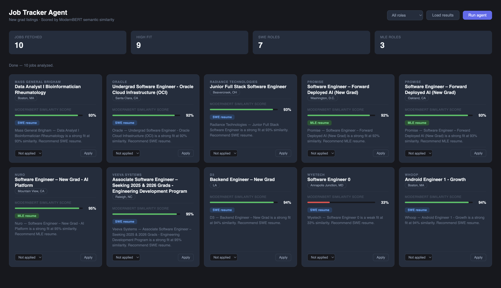

# Agentic Job Tracker

A LangGraph pipeline that fetches live job listings, filters them, scores fit against a candidate profile using ModernBERT embeddings, and serves results through a FastAPI backend.

## What it does

The system runs as a 4 node state graph. Each node has a single responsibility and passes a typed state object to the next.



`fetch_jobs` pulls live listings. `filter_jobs` removes inactive or irrelevant postings. `analyze_fit` embeds the candidate profile and each job description with ModernBERT, scores similarity, and classifies the best resume variant to use. `store_results` writes the scored output to disk, which the frontend reads.

## Why ModernBERT, and why inline

Early versions of this project ran ModernBERT scoring in a separate Colab notebook and fed the output into the app as a static file. That worked, but it meant the "agentic" pipeline didn't actually do the analysis, it just displayed someone else's batch job. That gap mattered enough to fix: `analyze_fit_node` now loads ModernBERT and runs inference directly inside the graph, so the full pipeline runs end to end from a single API call.

This came with a real tradeoff. Inference is synchronous and blocks the HTTP response, and on CPU (no GPU on the host machine), that means request latency scales linearly with job count. The alternative would be an async job queue with polling or websockets, which is the more production-correct pattern. For a single-user tool processing a bounded daily batch of listings, synchronous inline scoring was the simpler design that meets the actual constraint, but it would not hold up at higher concurrency or job volume without revisiting that decision.

ModernBERT was chosen over a fine-tuned classifier because the task is open-ended semantic matching against profile text that changes per resume variant, not a fixed label set. It was benchmarked against a TF-IDF and SentenceTransformer hybrid approach in a related project (see Movie Recommendation System) and underperformed there due to lack of similarity fine-tuning, a tradeoff worth knowing going in rather than discovering after the fact.

## Architecture details

- State is a `TypedDict` with `jobs`, `analyzed`, and `errors` fields. `jobs` and `analyzed` use last-write-wins semantics so each node replaces the list rather than appending to it. `errors` accumulates across nodes using `operator.add`, since multiple nodes can independently fail without one error overwriting another.
- The ModernBERT model is loaded once per process via a lazy singleton in `tools/scorer.py`. The first request pays the model load cost, subsequent requests in the same process reuse it.
- `POST /analyze` runs the full pipeline and writes results to `data/results.json`. `GET /results` serves the cached file without re-running inference.

## Known limitations

This is a working single-user prototype, not a production service. Specific gaps:

- No request deduplication. Two concurrent calls to `/analyze` will run two full inference passes rather than sharing one.
- No async execution. Inference blocks the request thread for its full duration.
- The candidate profile embedding is recomputed on every call rather than cached.
- No offline fallback if the ModernBERT weights aren't already cached locally, first run requires a network call to HuggingFace Hub.

## Running it locally

```bash
git clone https://github.com/rahulrubugunday/agentic-job-tracker.git
cd agentic-job-tracker
pip install -r requirements.txt
uvicorn main:app --reload
```

In a separate terminal:

```bash
# Run the full pipeline: fetch, filter, score, store
curl -X POST http://localhost:8000/analyze

# Retrieve cached results without re-running inference
curl http://localhost:8000/results
```

On first run, the model downloads from HuggingFace Hub (~600MB) if not already cached locally. Edit `data/profile.txt` to change which candidate profile is being matched against.

## Stack

Python, LangGraph, FastAPI, ModernBERT (HuggingFace Transformers), vanilla JS frontend.

## Screenshot


